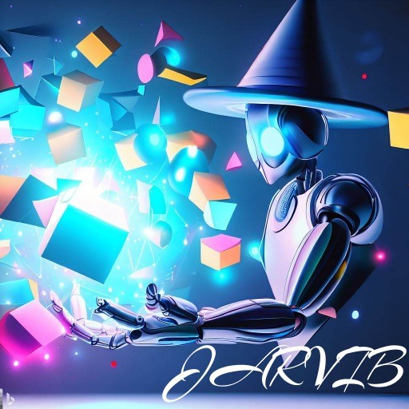
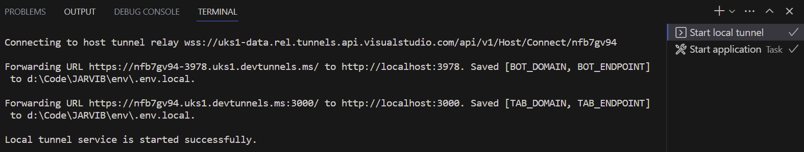
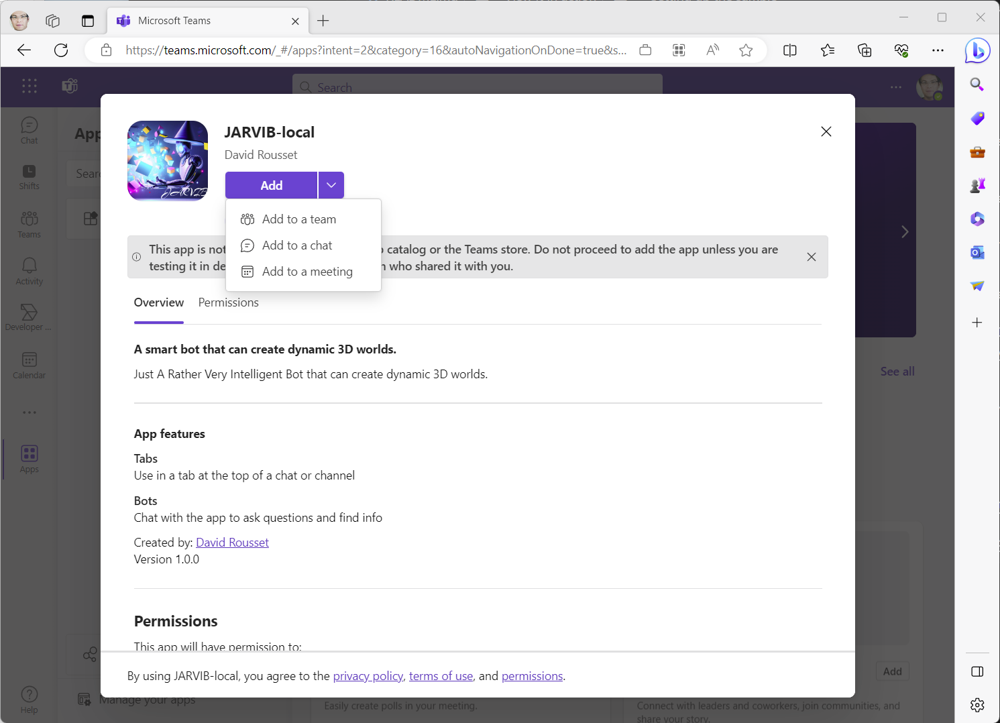
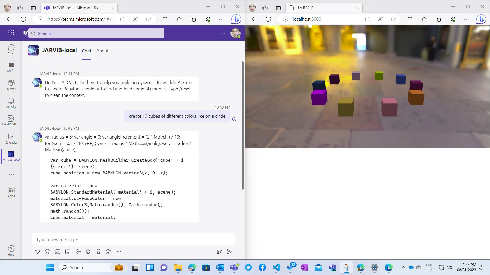
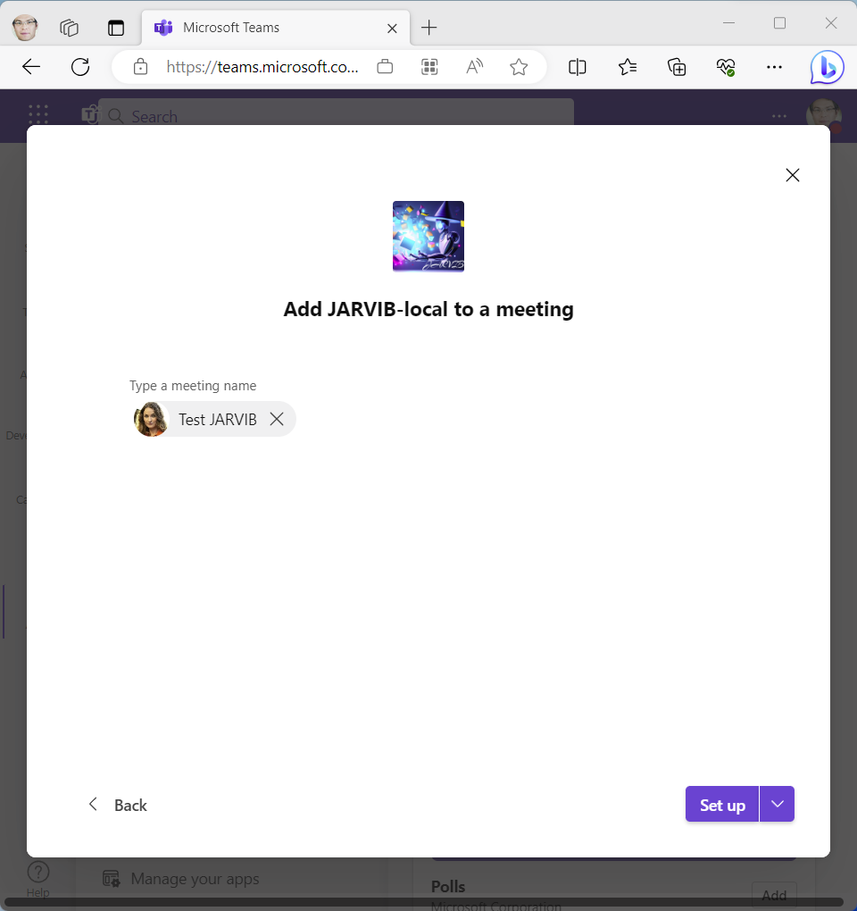
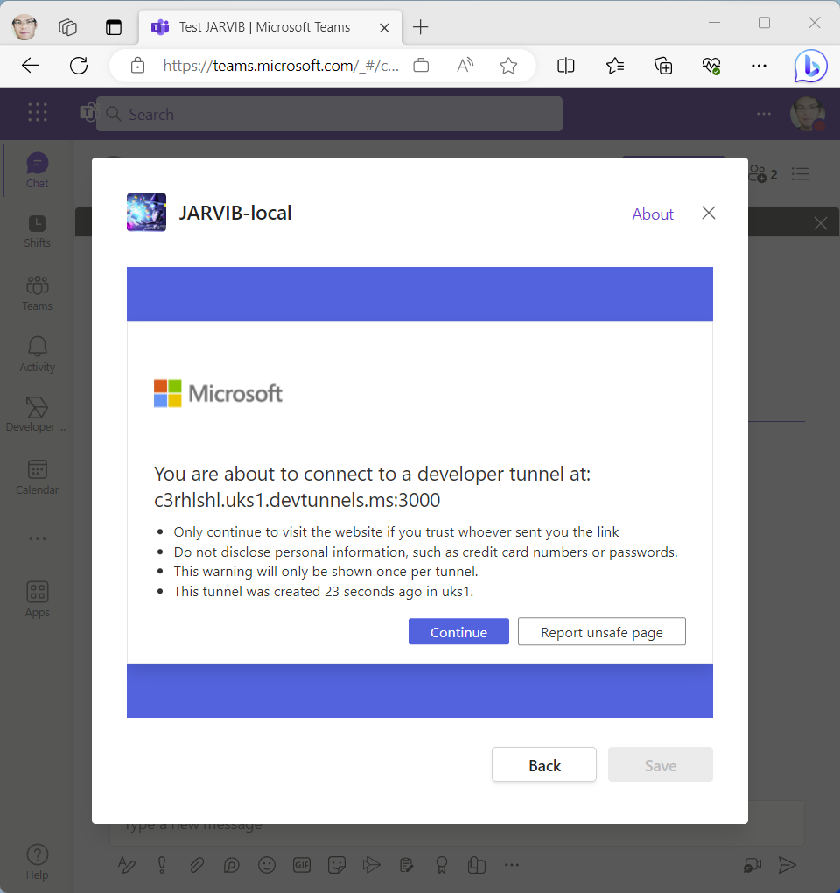
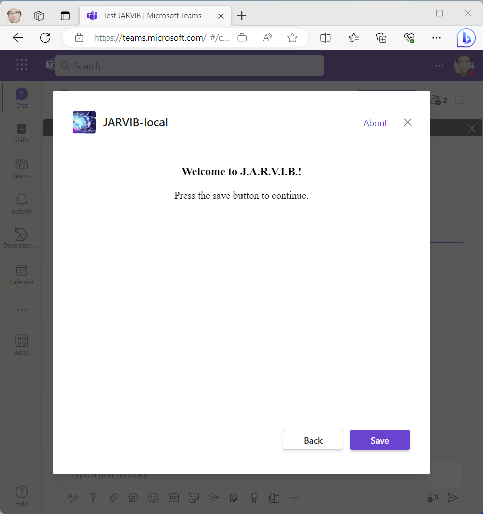
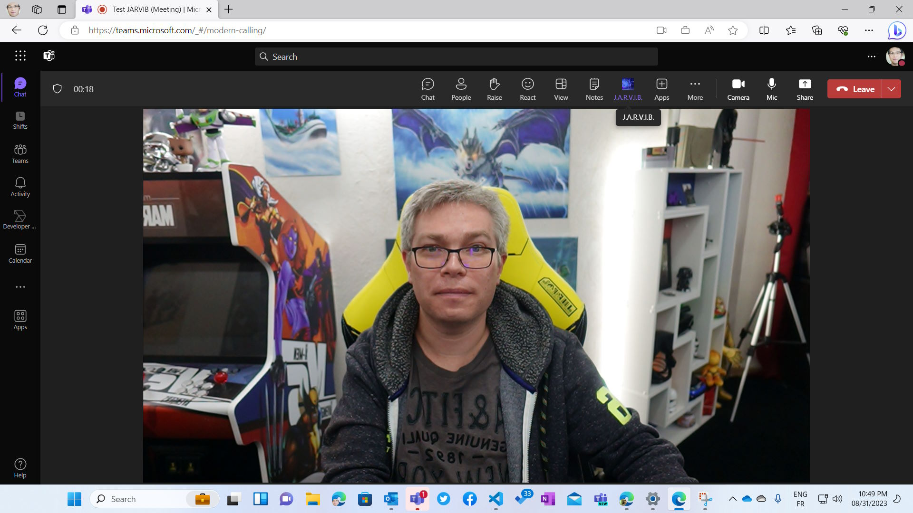
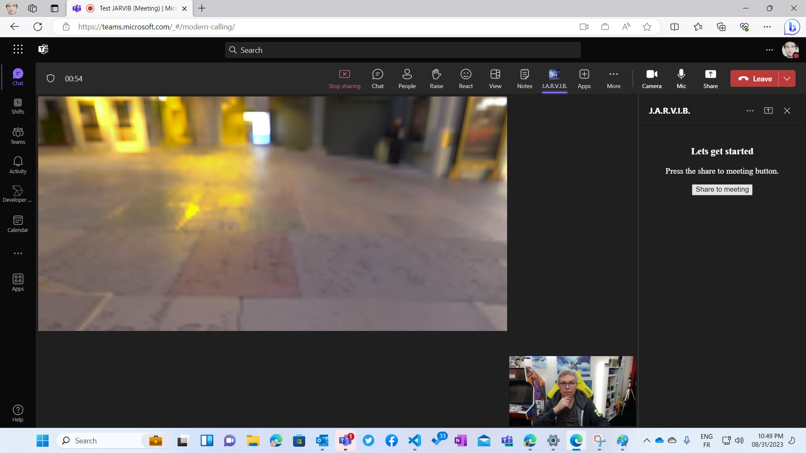
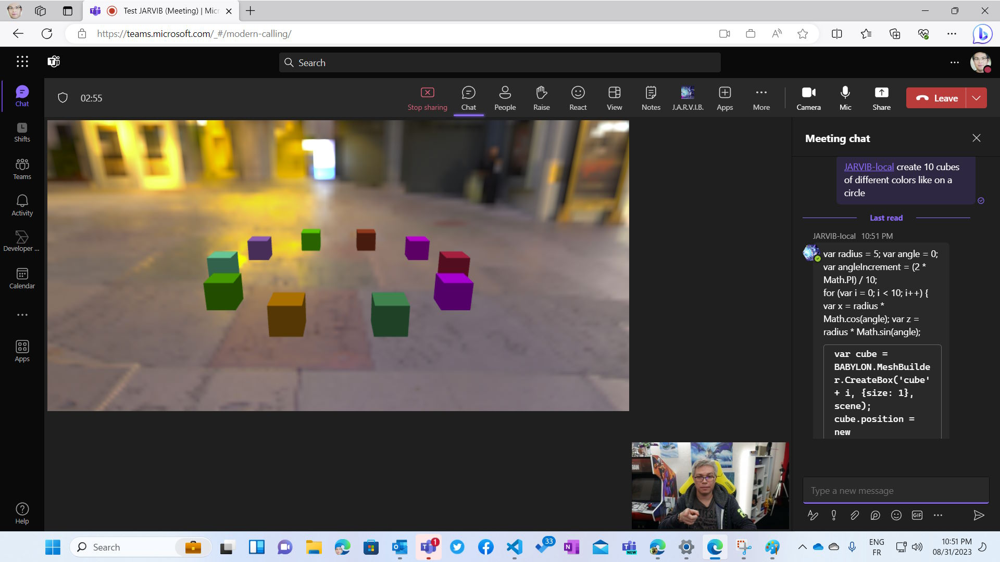

# AI in Microsoft Teams: J.A.R.V.I.B.

*Your custom Microsoft Teams AI Copilot to build interactive dynamic 3D worlds*



JARVIB (Just A Rather Very Intelligent Bot) is your personnal Copilot to help you designing 3D worlds in a collaborative way inside a personnal conversation or in a Teams meeting. Ask him to create various Babylon.js primitive or to search for specific models to load them into the scene. You can also ask to the AI to visually describe the scene for accessibility reasons. Look at possible prompts in ```promptsExamples.txt```

<!-- @import "[TOC]" {cmd="toc" depthFrom=1 depthTo=6 orderedList=false} -->

<!-- code_chunk_output -->

-   [AI in Microsoft Teams: J.A.R.V.I.B.](#ai-in-microsoft-teams-list-bot)
    -   [View it in action](#view-it-in-action)
    -   [Setting up the sample](#setting-up-the-sample)
    -   [Interacting with the bot](#interacting-with-the-bot)
    -   [Further reading](#further-reading)

<!-- /code_chunk_output -->

## View it in action

[](https://www.youtube.com/watch?v=181D9lk7DRc)

JARVIB is using the Teams AI library to map users' intent to 3 different type of actions:

- **codeToExecute** which will take the Babylon.js code generated by the LLM and send it to the web page containing the 3D canvas to execute it via WebSocket
- **listAvailableModel** which will use the same API as PowerPoint to find for existing 3D models and return a list of available models to load through an Adaptive Card list. It uses the ```javascriptapp.ai.chain()``` function.
- **loadThisModel** which will load one of the models exposed in the list displayed before

You have also 3 commands available:

- **/reset** will clear the conversation state, clean the various objects states and reload the web page containing the 3D canvas to start from scratch
- **/describe** will ask to the AI, via the text-davinci-003 LLM model to visually describe the scene
- **/fullcode** will return all Babylon.js code executed so far so you can copy/paste it in your project or in the Babylon.js Playground

Look at the ```/src/prompts``` folder to check how the various actions are described in ```/ChatGPT/skprompt.txt``` for the 3 Teams AI actions, ```/listmodels/skprompt.txt``` to generate the Adaptive Card list and ```/describe/skprompt.txt``` for the visual description. 

```
Pretend you're an expert in Babylon.js, the JavaScript WebGL 3D engine. 
You can either return the Babylon.js API JavaScript code to execute, 
detect that the user would like to load a new model or mesh or 3D object to the actual scene, 
or find for available 3D models for a specific keyword.

Assume there is already an existing Babylon.js scene and engine so you don't have to create them, just generate the code to add into an existing program.
Use the scene and engine objects directly. 

The following actions are supported:

- codeToExecute code="<text>"
- listAvailableModel nameOfTheModel="<text>"
- loadThisModel nameOfTheModel="<text>"
```

## Setting up the sample

1. Clone the repository

    ```bash
    git clone https://github.com/davrous/JARVIB.git
    ```

2. Install the Teams Toolkit: https://learn.microsoft.com/en-us/microsoftteams/platform/toolkit/install-teams-toolkit

3. Set your Azure OpenAI key, endpoints and model names or your OpenAI key in the .env file. 

    For Azure OpenAI, pay attention to use the "*Deployment name*" and not the "*Model name*" as the value for the properties in the .env file. If you've got an error 404 during execution, it's because you either entered the wrong endpoint or the wrong deployment name. 

4. Press F5! 

    The Team Toolkit will do a lot of magic for you by: 
    - installing all dependencies and building the TypeScript code
    - registering the bot in the Azure Active Directory
    - building the Teams manifest file, zipping the resources to upload them in the Teams Developer Portal
    - creating 2 tunnels to expose your localhost on public URLs using VS Dev Tunnels, you can find the details in ```/.vscode/tasks.json```
        - 1 for the bot itself mapped on port 3978
        - 1 for the tab to be used inside a Teams meeting mapped on port 3000
    - launching the Teams web app to let you install the bot / meeting extension

5. If everything goes well, you should first be able that the 2 tunnels have been created:



6. Then, the webserver will be launched and you'll be asked to install JARVIB in your developer tenant:



You can either simply press the "*Add*" button and this will install the app to let you discuss with it directly as a classical bot. 

You can also add it to an existing meeting to be able to replicate the full experience showcased in the video. 

## Interacting with the bot

The easiest way to try it is to install it using the "*Add*" button as a bot, then open http://localhost:3000/debug.html on the side open a simple canvas 3D websocket client. Then ask to the bot to create 3D content, load some models and so on:



The other option to replicate the full experience is to load the app inside an existing meeting:



You need to accept connecting to the VS Dev Tunnel redirecting to your localhost developer machine:



Finally, save JARVIB as an app part of this chosen Teams meeting:



Now, launch the Teams meeting alone or with someone else to collaborate with:



Click on the JARVIB icon and then click on the "*Share to meeting*" button:



Finally, call the AI bot via @JARVIB-local following your order:



## Further reading

- [Teams AI library](https://learn.microsoft.com/en-us/microsoftteams/platform/bots/how-to/teams%20conversational%20ai/teams-conversation-ai-overview)
- [Azure OpenAI](https://learn.microsoft.com/en-us/azure/ai-services/openai/overview)
-   [Teams Toolkit overview](https://learn.microsoft.com/en-us/microsoftteams/platform/toolkit/teams-toolkit-fundamentals)
-   [How Microsoft Teams bots work](https://docs.microsoft.com/en-us/azure/bot-service/bot-builder-basics-teams?view=azure-bot-service-4.0&tabs=javascript)
